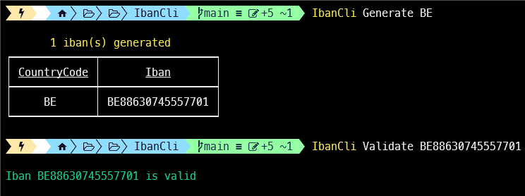

[](https://github.com/aimenux/IbanCli/actions/workflows/ci.yml)

# IbanCli
```
Providing a global tool in order to validate and generate ibans
```

> In this repo, i m building a global tool that allows to validate and generate ibans.
>
> The tool is based on two sub commmands :
> - Use sub command `Validate` to validate an iban
> - Use sub command `Generate` to generate an iban
>
>
> To run code in debug or release mode, type the following commands in your favorite terminal : 
> - `.\App.exe Generate BE`
> - `.\App.exe Validate BE88630745557701`
>
>
> To install, run, update, uninstall global tool from a local source path, type commands :
> - `dotnet tool install -g --configfile .\nugets\local.config IbanCli --version "*-*" --ignore-failed-sources`
> - `IbanCli -h`
> - `IbanCli Generate BE`
> - `IbanCli Validate BE88630745557701`
> - `dotnet tool update -g IbanCli --ignore-failed-sources`
> - `dotnet tool uninstall -g IbanCli`
>
> To install global tool from [nuget source](https://www.nuget.org/packages/IbanCli), type these command :
> - For stable version : `dotnet tool install -g IbanCli --ignore-failed-sources`
> - For prerelease version : `dotnet tool install -g IbanCli --version "*-*" --ignore-failed-sources`
>
>
> 
>

**`Tools`** : net 8.0, iban-net, command-line, spectre-console